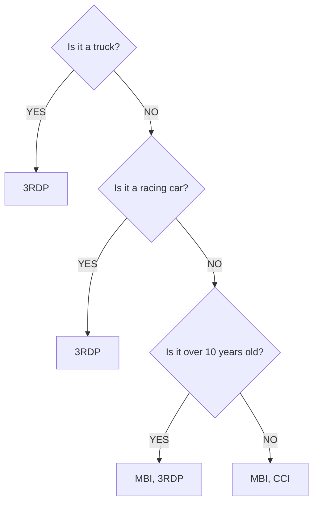
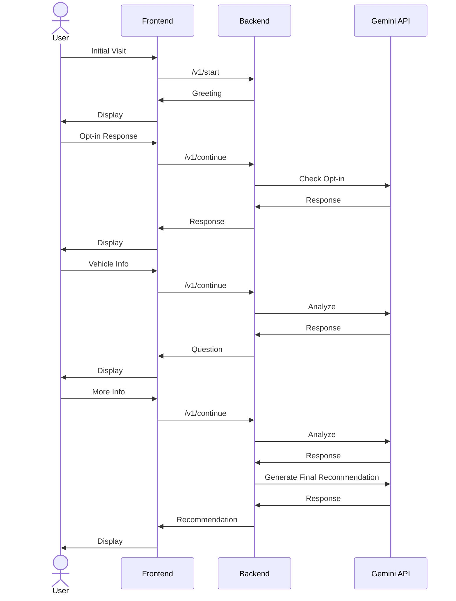
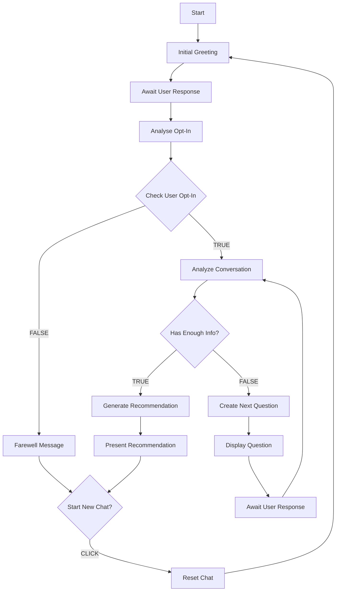

# AI Chat Assistant Project Documentation

## Project Overview

This project implements an AI-powered insurance recommendation chatbot named Tina using Deno, Hono, and Google's Generative AI (Gemini). The chatbot helps users find appropriate insurance policies based on their vehicle type and characteristics.

It is a full-stack chat application that provides a modern, responsive interface for users to interact with an AI assistant.

### Chatbot Architecture - High Level


### Chatbot Technology Stack


### Chatbot UI


### Chatbot Policy Recommendaiton


## Technology Stack

### Backend
- **Runtime**: Deno 2.1.1
- **Framework**: Hono v4.1.2
- **JS Runtime**: V8 13.0.245.12-rusty
- **TypeScript**: 5.6.2
- **AI Integration**: Google Generative AI (Gemini-1.5-flash)
- **Environment**: Configurable via `.env`
- **Standard Library**: Deno std@0.220.0

### Frontend
- **Framework**: React 18 with TypeScript
- **Build Tool**: Vite
- **UI Framework**: Tailwind CSS
- **Components**: Headless UI
- **HTTP Client**: Axios
- **Markdown Rendering**: React Markdown

## Passing Integration Test Run with Deno Test Runner and Hono

### Deno Test Runner

```bash
cd backend/
deno task test
```

### Deno Test Runner Output

[Deno Insurance Assistant ChatBot-Gemini Integration Test](DENO_TESTS.md)


## Gemini Model Fine-tuning

- The Gemini model was fine-tuned to sound more like Tina, and behave like an AI insurance policy assistant.
- The fine tuned model was not used in the end due to the followin limitations
  - Fine-tuned models cannot not be used with system instructions, which is an important feature required for this application.
  - Fine-tuned models cannot produce structured JSON output.
  - Fine-tuned models cannot be tuned on multi-turn conversational data, only on q&a datasets. Multi-turn training is not available in the Gemini SDK but appears to be available in the Vertex AI SDK.
- In the end I opted for detailed systems instructions over fine-tuning.
- Future ideas.
  - To effectivelly fine the Gemini model we would need to...
    - Generate synthetic data of 100's of multi-turn coversations with Tina, that model the behaviors we require.
    - Train it using the Vertex AI SDK
    - Ideally use system instructions as well, as these keep the system prompt out of the chat history. I need to research if this is possible with Vertex AI.

[Gemini Fine Tuning Notes](FINE_TUNING_GEMINI_NOTES.md)

### Gemini Training - Loss curve from the tuning results. The loss curve shows how much the model's predictions deviate from the ideal outputs.


### Some Simple Tests of the Trained Model


## Getting Started

### Running with Docker Compose

#### Development Environment
```bash
docker compose --profile development up
```

#### Production Environment
```bash
docker compose --profile production up --build
```

### Running Locally

#### Backend
```bash
cd backend
deno task dev
```
Backend runs on port 8000

#### Backend Test
```bash
cd backend
deno task test
```

#### Frontend
```bash
cd frontend
npm install
npm run dev
```
Frontend runs on port 5173

## API Endpoints

### Chat API (`/chat`)
All endpoints are prefixed with `/chat`

#### 1. Start Chat
- **Endpoint**: `/v1/start`
- **Method**: POST
- **Purpose**: Initiates a new chat session
- **Body**:
  ```json
  {
    "message": "string",
    "history": []
  }
  ```

#### 2. Continue Chat
- **Endpoint**: `/v1/continue`
- **Method**: POST
- **Purpose**: Continues an existing chat conversation
- **Body**:
  ```json
  {
    "message": "string",
    "history": []
  }
  ```

#### 3. Get Recommendations
- **Endpoint**: `/v1/recommend`
- **Method**: POST
- **Purpose**: Retrieves insurance recommendations based on conversation
- **Body**:
  ```json
  {
    "context": "string",
    "history": []
  }
  ```

### Health Check
- **Endpoint**: `/health`
- **Method**: GET
- **Purpose**: Checks API health status

## Project Structure
```
.
├── backend/
│   ├── src/
│   │   ├── config/
│   │   │   └── env.ts
│   │   ├── routes/
│   │   │   └── chat.ts
│   │   ├── services/
│   │   │   └── chat.service.ts
│   │   └── index.ts
│   ├── tests/
│   │   └── chat.test.ts
│   └── Dockerfile
├── frontend/
│   ├── src/
│   │   ├── components/
│   │   ├── App.tsx
│   │   └── index.tsx
│   └── Dockerfile
└── docker-compose.yml
```

## Insurance Policy Rules

The chatbot recommends insurance policies based on the following business rules:

1. For trucks or racing cars:
   - Only Third Party Car Insurance (3RDP) is available

2. For non-truck, non-racing cars:
   - If over 10 years old: Both Mechanical Breakdown Insurance (MBI) and Third Party Car Insurance (3RDP) are available
   - If 10 years or younger: Both Mechanical Breakdown Insurance (MBI) and Comprehensive Car Insurance (CCI) are available

### Decision Tree
```
Is it a truck?
├── YES → [3RDP]
└── NO
    └── Is it a racing car?
        ├── YES → [3RDP]
        └── NO
            └── Is it over 10 years old?
                ├── YES → [MBI, 3RDP]
                └── NO → [MBI, CCI]
```




## Interaction Flow Swimlane Diagram



## Interaction Flow - Flow Chart



## Key Features
1. Enthusiastic and friendly chatbot personality
2. Intelligent conversation flow using decision trees
3. Robust error handling with exponential backoff
4. Clear insurance policy recommendations
5. Vehicle type and age analysis
6. Docker containerization for both frontend and backend
7. Docker Development and production environment configurations
8. Comprehensive API endpoints
9. Health monitoring
10. Markdown support for AI responses
11. Responsive design using Tailwind CSS
12. Real-time chat interface with AI

## Environment Variables
- `PORT`: Server port (default: 8000)
- `GEMINI_API_KEY`: Google Generative AI API key
- `DENO_ENV`: Environment type (development/production)
- `VITE_API_URL`: Backend API URL for frontend


## Security Considerations

- API keys are managed through environment variables
- Structured JSON responses prevent injection attacks
- Input validation at all endpoints


## Environment Setup

### Backend (.env)
```env
PORT=8000
GEMINI_API_KEY=your_api_key_here
DENO_ENV=development
```

### Frontend (.env)
```env
VITE_API_URL=http://localhost:8000
```

## Design Decisions

### Frontend Architecture
- Clean separation of components and API logic
- Responsive design with mobile-first approach
- Efficient state management using React hooks
- Modern UI with Tailwind CSS for styling

### Backend Architecture
- Modular structure with clear separation of concerns
- Service-based architecture for AI integration
- Environment-based configuration
- Efficient error handling and response formatting

### Container Strategy
- Separate development and production configurations
- Volume mounts for hot reloading in development
- Environment-specific optimizations
- Network isolation using Docker Compose

## Development Workflow
1. Start with local development using native commands
2. Test changes in development Docker environment
3. Build and test production Docker environment
4. Deploy production containers

## Best Practices
- Use TypeScript for type safety
- Follow ESLint rules for code consistency
- Keep environment variables secure
- Regular testing of both frontend and backend
- Document code changes and new features

## Testing

### Backend Testing
The backend uses Deno's built-in testing framework. Tests are located in the `backend/tests` directory.

#### Running Tests
```bash
cd backend
deno task test
```

```bash
deno task test                                                                                                                                                                                        ─╯
Task test deno test --allow-net --allow-read --allow-env
Check file:///[path]/mission_ready/level-05/mission-05/research/deno-2-hono-react-nextjs/backend/tests/chat.test.ts
running 3 tests from ./tests/chat.test.ts
Chat API - /v1/start - should require message ... ok (5ms)
Chat API - /v1/continue - should require history and message ... ok (0ms)
Chat API - /v1/recommend - should require context ... ok (0ms)

ok | 3 passed | 0 failed (11ms)
```


#### Test Structure
- **API Tests** (`chat.test.ts`):
  - Tests for chat endpoint input validation
  - Tests for required fields in requests
  - Tests for error handling
  - Tests for API response format

#### Test Coverage
Current test suite covers:
- Input validation for all chat endpoints
- Error handling for missing required fields
- API response format validation


# Chat Service Documentation

## Overview
The chat service is a core component of the insurance recommendation system, powered by Google's Generative AI (Gemini). It provides an interactive, AI-driven conversation interface for helping users find appropriate insurance policies based on their vehicle characteristics.

## Key Components

### Core Interfaces

```typescript
interface ChatMessage {
  role: 'user' | 'model';  // Identifies message sender
  parts: string;          // Message content
}

interface InsuranceRecommendation {
  hasTruck: boolean;
  hasRacingCar: boolean;
  hasOldCar: boolean;
  hasEnoughInfo: boolean;
  policyRecommendation: "MBI" | "CCI" | "3RDP" | "NULL";
  policyRecommendations: ("MBI" | "CCI" | "3RDP")[];
  carAgeStatus: "CONFIRMED_OLD" | "CONFIRMED_NEW" | "UNKNOWN";
}
```

## API Endpoints

### 1. Start Chat
- **Endpoint**: `/chat/v1/start`
- **Method**: POST
- **Purpose**: Initiates a new chat session
- **Request Body**:
  ```typescript
  {
    message?: string;    // Optional initial message
    history?: ChatMessage[];  // Optional chat history
  }
  ```
- **Response**: Initial greeting or processed first message

### 2. Continue Chat
- **Endpoint**: `/chat/v1/continue`
- **Method**: POST
- **Purpose**: Continues an existing chat session
- **Request Body**:
  ```typescript
  {
    message: string;          // Required user message
    history: ChatMessage[];   // Required chat history
  }
  ```
- **Response**: Next AI response based on conversation analysis

### 3. Recommendations
- **Endpoint**: `/chat/v1/recommend`
- **Method**: POST
- **Purpose**: Generates contextual recommendations
- **Request Body**:
  ```typescript
  {
    context: string;          // Required context
    history?: ChatMessage[];  // Optional chat history
  }
  ```

## Core Functionality

### 1. Conversation Management
- **startChat()**: Initiates conversations with personalized greeting
- **continueChat()**: Processes ongoing conversations
- **checkOptIn()**: Verifies user consent
- **analyzeConversation()**: Determines vehicle information
- **generateRecommendation()**: Creates policy recommendations

### 2. Error Handling
- Implements exponential backoff for API retries
- Maximum 5 retry attempts
- Delay sequence: 2, 4, 8, 16, 32 seconds
- Comprehensive error logging

### 3. Business Logic

#### Vehicle Classification
- **Truck**: Specialized vehicle category
- **Racing Car**: Performance vehicle category
- **Regular Car**: Standard vehicle category
  - Age > 10 years: Old category
  - Age ≤ 10 years: New category

#### Policy Types
1. **MBI** (Mechanical Breakdown Insurance)
   - Available for regular cars
   - Primary choice for newer vehicles

2. **CCI** (Comprehensive Car Insurance)
   - Available for regular cars
   - Recommended for newer vehicles

3. **3RDP** (Third Party Car Insurance)
   - Available for all vehicle types
   - Primary choice for trucks and racing cars

## Configuration

```typescript
interface Config {
  PORT: number;                // Server port (default: 8000)
  GEMINI_API_KEY: string;     // Required for AI functionality
  AI_STUDIO_API_KEY: string;  // Additional AI capabilities
  NODE_ENV: string;           // Environment setting
}
```

## Conversation Flow

### 1. Initial Interaction
```typescript
const INITIAL_GREETING = "Hey there! I'm Tina and you know what? I absolutely LOVE cars! Big ones, tiny ones, speedy ones - they're all amazing! To help you find the perfect insurance for your awesome ride, I'll need to ask you a few quick questions about your car. Is that cool with you?";
```

### 2. Information Gathering
- Vehicle type identification
- Age verification (if applicable)
- Explicit confirmation of details

### 3. Policy Matching
- Based on vehicle characteristics
- Follows business rules
- Maintains casual, enthusiastic tone

## Security Features

1. **API Protection**
   - CORS configuration
   - Input validation
   - Structured responses

2. **Environment Management**
   - Secure key storage
   - Environment-specific configurations

## Usage Example

```typescript
// Initialize chat
const response = await fetch('/chat/v1/start', {
  method: 'POST',
  headers: { 'Content-Type': 'application/json' },
  body: JSON.stringify({ message: "Hi, I need insurance for my car" })
});

// Continue conversation
const continueResponse = await fetch('/chat/v1/continue', {
  method: 'POST',
  headers: { 'Content-Type': 'application/json' },
  body: JSON.stringify({
    message: "It's a 2015 Toyota Corolla",
    history: previousChatHistory
  })
});
```

## Best Practices

1. **Error Handling**
   - Always implement retry logic for API calls
   - Log errors comprehensively
   - Provide user-friendly error messages

2. **Conversation Flow**
   - Maintain context through chat history
   - Verify critical information explicitly
   - Use consistent tone and personality

3. **Security**
   - Validate all inputs
   - Protect sensitive information
   - Follow environment-specific configurations
